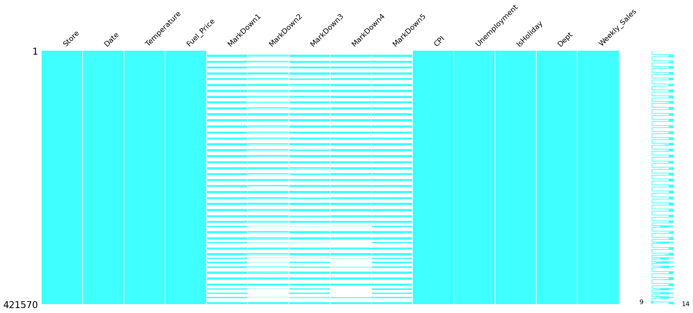

```python
import pandas as pd
import plotly.express as px
import seaborn as sns
import missingno as msno
import matplotlib.pyplot as plt
```


```python
features = pd.read_csv('Features data set.csv')
sales = pd.read_csv('sales data-set.csv')
stores = pd.read_csv('stores data-set.csv')
features.head()

```


<div>
<style scoped>
    .dataframe tbody tr th:only-of-type {
        vertical-align: middle;
    }

    .dataframe tbody tr th {
        vertical-align: top;
    }

    .dataframe thead th {
        text-align: right;
    }
</style>
<table border="1" class="dataframe">
  <thead>
    <tr style="text-align: right;">
      <th></th>
      <th>Store</th>
      <th>Date</th>
      <th>Temperature</th>
      <th>Fuel_Price</th>
      <th>MarkDown1</th>
      <th>MarkDown2</th>
      <th>MarkDown3</th>
      <th>MarkDown4</th>
      <th>MarkDown5</th>
      <th>CPI</th>
      <th>Unemployment</th>
      <th>IsHoliday</th>
    </tr>
  </thead>
  <tbody>
    <tr>
      <th>0</th>
      <td>1</td>
      <td>05/02/2010</td>
      <td>42.31</td>
      <td>2.572</td>
      <td>NaN</td>
      <td>NaN</td>
      <td>NaN</td>
      <td>NaN</td>
      <td>NaN</td>
      <td>211.096358</td>
      <td>8.106</td>
      <td>False</td>
    </tr>
    <tr>
      <th>1</th>
      <td>1</td>
      <td>12/02/2010</td>
      <td>38.51</td>
      <td>2.548</td>
      <td>NaN</td>
      <td>NaN</td>
      <td>NaN</td>
      <td>NaN</td>
      <td>NaN</td>
      <td>211.242170</td>
      <td>8.106</td>
      <td>True</td>
    </tr>
    <tr>
      <th>2</th>
      <td>1</td>
      <td>19/02/2010</td>
      <td>39.93</td>
      <td>2.514</td>
      <td>NaN</td>
      <td>NaN</td>
      <td>NaN</td>
      <td>NaN</td>
      <td>NaN</td>
      <td>211.289143</td>
      <td>8.106</td>
      <td>False</td>
    </tr>
    <tr>
      <th>3</th>
      <td>1</td>
      <td>26/02/2010</td>
      <td>46.63</td>
      <td>2.561</td>
      <td>NaN</td>
      <td>NaN</td>
      <td>NaN</td>
      <td>NaN</td>
      <td>NaN</td>
      <td>211.319643</td>
      <td>8.106</td>
      <td>False</td>
    </tr>
    <tr>
      <th>4</th>
      <td>1</td>
      <td>05/03/2010</td>
      <td>46.50</td>
      <td>2.625</td>
      <td>NaN</td>
      <td>NaN</td>
      <td>NaN</td>
      <td>NaN</td>
      <td>NaN</td>
      <td>211.350143</td>
      <td>8.106</td>
      <td>False</td>
    </tr>
  </tbody>
</table>
</div>


```python
sales.head()
```


<div>
<style scoped>
    .dataframe tbody tr th:only-of-type {
        vertical-align: middle;
    }

    .dataframe tbody tr th {
        vertical-align: top;
    }

    .dataframe thead th {
        text-align: right;
    }
</style>
<table border="1" class="dataframe">
  <thead>
    <tr style="text-align: right;">
      <th></th>
      <th>Store</th>
      <th>Dept</th>
      <th>Date</th>
      <th>Weekly_Sales</th>
      <th>IsHoliday</th>
    </tr>
  </thead>
  <tbody>
    <tr>
      <th>0</th>
      <td>1</td>
      <td>1</td>
      <td>05/02/2010</td>
      <td>24924.50</td>
      <td>False</td>
    </tr>
    <tr>
      <th>1</th>
      <td>1</td>
      <td>1</td>
      <td>12/02/2010</td>
      <td>46039.49</td>
      <td>True</td>
    </tr>
    <tr>
      <th>2</th>
      <td>1</td>
      <td>1</td>
      <td>19/02/2010</td>
      <td>41595.55</td>
      <td>False</td>
    </tr>
    <tr>
      <th>3</th>
      <td>1</td>
      <td>1</td>
      <td>26/02/2010</td>
      <td>19403.54</td>
      <td>False</td>
    </tr>
    <tr>
      <th>4</th>
      <td>1</td>
      <td>1</td>
      <td>05/03/2010</td>
      <td>21827.90</td>
      <td>False</td>
    </tr>
  </tbody>
</table>
</div>


```python
stores.head()
```


<div>
<style scoped>
    .dataframe tbody tr th:only-of-type {
        vertical-align: middle;
    }

    .dataframe tbody tr th {
        vertical-align: top;
    }

    .dataframe thead th {
        text-align: right;
    }
</style>
<table border="1" class="dataframe">
  <thead>
    <tr style="text-align: right;">
      <th></th>
      <th>Store</th>
      <th>Type</th>
      <th>Size</th>
    </tr>
  </thead>
  <tbody>
    <tr>
      <th>0</th>
      <td>1</td>
      <td>A</td>
      <td>151315</td>
    </tr>
    <tr>
      <th>1</th>
      <td>2</td>
      <td>A</td>
      <td>202307</td>
    </tr>
    <tr>
      <th>2</th>
      <td>3</td>
      <td>B</td>
      <td>37392</td>
    </tr>
    <tr>
      <th>3</th>
      <td>4</td>
      <td>A</td>
      <td>205863</td>
    </tr>
    <tr>
      <th>4</th>
      <td>5</td>
      <td>B</td>
      <td>34875</td>
    </tr>
  </tbody>
</table>
</div>


```python
data = pd.merge(features,sales, on = ['Store','Date','IsHoliday'], how='inner')
```


```python
msno.matrix(data,figsize=(25, 10),
    width_ratios=(15, 1),
    color=(0.25,1.0 ,1.0),    fontsize=16,
    labels=None,
    label_rotation=45,
    sparkline=True,)
plt.show()
```


    

    


```python
data['Date'] = pd.to_datetime(data['Date'], format = '%d/%m/%Y')
```


```python
data['Year'] = data['Date'].dt.year
data['Month'] = data['Date'].dt.month
data['Day'] = data['Date'].dt.day
```


```python
t = data.groupby('Date')['Weekly_Sales'].sum().reset_index()
fig = px.line(t, x='Date', y = 'Weekly_Sales')
fig.show()
```


```python
t = data.groupby(['Date','IsHoliday'])['Weekly_Sales'].sum().reset_index()
fig = px.line(t, x='Date', y = 'Weekly_Sales',color='IsHoliday')
fig.show()
```


```python
b = data.groupby(['Dept','Year'], as_index=False)['Weekly_Sales'].sum().reset_index()
b['Year'] = b['Year'].astype(str)
fig2 = px.bar(b, x='Dept', y = 'Weekly_Sales',color='Year',text='Dept')
fig2.update_yaxes(categoryorder='total ascending',title="Weekly sales sum",
    showgrid=True, gridcolor='lightgray', gridwidth=1)
fig2.update_xaxes(categoryorder='total descending',
    showgrid=True, gridcolor='lightgray', gridwidth=1,title="Department")
fig2.update_traces(
    textposition='outside',
    textfont=dict(
        size=32,
        color='black'
    )
)
fig2.show()
```


```python
data
```


<div>
<style scoped>
    .dataframe tbody tr th:only-of-type {
        vertical-align: middle;
    }

    .dataframe tbody tr th {
        vertical-align: top;
    }

    .dataframe thead th {
        text-align: right;
    }
</style>
<table border="1" class="dataframe">
  <thead>
    <tr style="text-align: right;">
      <th></th>
      <th>Store</th>
      <th>Date</th>
      <th>Temperature</th>
      <th>Fuel_Price</th>
      <th>MarkDown1</th>
      <th>MarkDown2</th>
      <th>MarkDown3</th>
      <th>MarkDown4</th>
      <th>MarkDown5</th>
      <th>CPI</th>
      <th>Unemployment</th>
      <th>IsHoliday</th>
      <th>Dept</th>
      <th>Weekly_Sales</th>
      <th>Year</th>
      <th>Month</th>
      <th>Day</th>
    </tr>
  </thead>
  <tbody>
    <tr>
      <th>0</th>
      <td>1</td>
      <td>2010-02-05</td>
      <td>42.31</td>
      <td>2.572</td>
      <td>NaN</td>
      <td>NaN</td>
      <td>NaN</td>
      <td>NaN</td>
      <td>NaN</td>
      <td>211.096358</td>
      <td>8.106</td>
      <td>False</td>
      <td>1</td>
      <td>24924.50</td>
      <td>2010</td>
      <td>2</td>
      <td>5</td>
    </tr>
    <tr>
      <th>1</th>
      <td>1</td>
      <td>2010-02-05</td>
      <td>42.31</td>
      <td>2.572</td>
      <td>NaN</td>
      <td>NaN</td>
      <td>NaN</td>
      <td>NaN</td>
      <td>NaN</td>
      <td>211.096358</td>
      <td>8.106</td>
      <td>False</td>
      <td>2</td>
      <td>50605.27</td>
      <td>2010</td>
      <td>2</td>
      <td>5</td>
    </tr>
    <tr>
      <th>2</th>
      <td>1</td>
      <td>2010-02-05</td>
      <td>42.31</td>
      <td>2.572</td>
      <td>NaN</td>
      <td>NaN</td>
      <td>NaN</td>
      <td>NaN</td>
      <td>NaN</td>
      <td>211.096358</td>
      <td>8.106</td>
      <td>False</td>
      <td>3</td>
      <td>13740.12</td>
      <td>2010</td>
      <td>2</td>
      <td>5</td>
    </tr>
    <tr>
      <th>3</th>
      <td>1</td>
      <td>2010-02-05</td>
      <td>42.31</td>
      <td>2.572</td>
      <td>NaN</td>
      <td>NaN</td>
      <td>NaN</td>
      <td>NaN</td>
      <td>NaN</td>
      <td>211.096358</td>
      <td>8.106</td>
      <td>False</td>
      <td>4</td>
      <td>39954.04</td>
      <td>2010</td>
      <td>2</td>
      <td>5</td>
    </tr>
    <tr>
      <th>4</th>
      <td>1</td>
      <td>2010-02-05</td>
      <td>42.31</td>
      <td>2.572</td>
      <td>NaN</td>
      <td>NaN</td>
      <td>NaN</td>
      <td>NaN</td>
      <td>NaN</td>
      <td>211.096358</td>
      <td>8.106</td>
      <td>False</td>
      <td>5</td>
      <td>32229.38</td>
      <td>2010</td>
      <td>2</td>
      <td>5</td>
    </tr>
    <tr>
      <th>...</th>
      <td>...</td>
      <td>...</td>
      <td>...</td>
      <td>...</td>
      <td>...</td>
      <td>...</td>
      <td>...</td>
      <td>...</td>
      <td>...</td>
      <td>...</td>
      <td>...</td>
      <td>...</td>
      <td>...</td>
      <td>...</td>
      <td>...</td>
      <td>...</td>
      <td>...</td>
    </tr>
    <tr>
      <th>421565</th>
      <td>45</td>
      <td>2012-10-26</td>
      <td>58.85</td>
      <td>3.882</td>
      <td>4018.91</td>
      <td>58.08</td>
      <td>100.0</td>
      <td>211.94</td>
      <td>858.33</td>
      <td>192.308899</td>
      <td>8.667</td>
      <td>False</td>
      <td>93</td>
      <td>2487.80</td>
      <td>2012</td>
      <td>10</td>
      <td>26</td>
    </tr>
    <tr>
      <th>421566</th>
      <td>45</td>
      <td>2012-10-26</td>
      <td>58.85</td>
      <td>3.882</td>
      <td>4018.91</td>
      <td>58.08</td>
      <td>100.0</td>
      <td>211.94</td>
      <td>858.33</td>
      <td>192.308899</td>
      <td>8.667</td>
      <td>False</td>
      <td>94</td>
      <td>5203.31</td>
      <td>2012</td>
      <td>10</td>
      <td>26</td>
    </tr>
    <tr>
      <th>421567</th>
      <td>45</td>
      <td>2012-10-26</td>
      <td>58.85</td>
      <td>3.882</td>
      <td>4018.91</td>
      <td>58.08</td>
      <td>100.0</td>
      <td>211.94</td>
      <td>858.33</td>
      <td>192.308899</td>
      <td>8.667</td>
      <td>False</td>
      <td>95</td>
      <td>56017.47</td>
      <td>2012</td>
      <td>10</td>
      <td>26</td>
    </tr>
    <tr>
      <th>421568</th>
      <td>45</td>
      <td>2012-10-26</td>
      <td>58.85</td>
      <td>3.882</td>
      <td>4018.91</td>
      <td>58.08</td>
      <td>100.0</td>
      <td>211.94</td>
      <td>858.33</td>
      <td>192.308899</td>
      <td>8.667</td>
      <td>False</td>
      <td>97</td>
      <td>6817.48</td>
      <td>2012</td>
      <td>10</td>
      <td>26</td>
    </tr>
    <tr>
      <th>421569</th>
      <td>45</td>
      <td>2012-10-26</td>
      <td>58.85</td>
      <td>3.882</td>
      <td>4018.91</td>
      <td>58.08</td>
      <td>100.0</td>
      <td>211.94</td>
      <td>858.33</td>
      <td>192.308899</td>
      <td>8.667</td>
      <td>False</td>
      <td>98</td>
      <td>1076.80</td>
      <td>2012</td>
      <td>10</td>
      <td>26</td>
    </tr>
  </tbody>
</table>
<p>421570 rows × 17 columns</p>
</div>


```python
dept_sales = data.groupby('Dept').agg(
    sales=('Weekly_Sales', 'sum'),
    #size=('Size', 'mean'),
).sort_values(by='sales', ascending=False).reset_index().head(10)
dept_sales

```


<div>
<style scoped>
    .dataframe tbody tr th:only-of-type {
        vertical-align: middle;
    }

    .dataframe tbody tr th {
        vertical-align: top;
    }

    .dataframe thead th {
        text-align: right;
    }
</style>
<table border="1" class="dataframe">
  <thead>
    <tr style="text-align: right;">
      <th></th>
      <th>Dept</th>
      <th>sales</th>
    </tr>
  </thead>
  <tbody>
    <tr>
      <th>0</th>
      <td>92</td>
      <td>4.839433e+08</td>
    </tr>
    <tr>
      <th>1</th>
      <td>95</td>
      <td>4.493202e+08</td>
    </tr>
    <tr>
      <th>2</th>
      <td>38</td>
      <td>3.931181e+08</td>
    </tr>
    <tr>
      <th>3</th>
      <td>72</td>
      <td>3.057252e+08</td>
    </tr>
    <tr>
      <th>4</th>
      <td>90</td>
      <td>2.910685e+08</td>
    </tr>
    <tr>
      <th>5</th>
      <td>40</td>
      <td>2.889360e+08</td>
    </tr>
    <tr>
      <th>6</th>
      <td>2</td>
      <td>2.806112e+08</td>
    </tr>
    <tr>
      <th>7</th>
      <td>91</td>
      <td>2.167817e+08</td>
    </tr>
    <tr>
      <th>8</th>
      <td>13</td>
      <td>1.973216e+08</td>
    </tr>
    <tr>
      <th>9</th>
      <td>8</td>
      <td>1.942808e+08</td>
    </tr>
  </tbody>
</table>
</div>


```python
top_depts = dept_sales.sort_values(by='sales', ascending=False)
top_depts['Dept'] = top_depts['Dept'].astype(str)
top_depts['Dept'] = pd.Categorical(top_depts['Dept'], categories=top_depts['Dept'], ordered=True)
```


```python
fig= px.bar(top_depts,x='Dept',y = 'sales')
fig.update_yaxes(categoryorder='total ascending',
    showgrid=True, gridcolor='lightgray', gridwidth=1, title="Weekly sales sum",)
fig.update_xaxes(showgrid=True, gridcolor='lightgray',
    title="Department"
)
fig.update_layout(
    title={
        "text": "Top departments by weeakly sales",
        "font": {
            "size": 24,
            "color": "black"
        }
        }
)
fig.show()
```


```python
dept_sales = data.groupby('Dept').agg(
    sales=('Weekly_Sales', 'sum'),
    #size=('Size', 'mean'),
).sort_values(by='sales', ascending=False).reset_index().tail(5)
dept_sales
```


<div>
<style scoped>
    .dataframe tbody tr th:only-of-type {
        vertical-align: middle;
    }

    .dataframe tbody tr th {
        vertical-align: top;
    }

    .dataframe thead th {
        text-align: right;
    }
</style>
<table border="1" class="dataframe">
  <thead>
    <tr style="text-align: right;">
      <th></th>
      <th>Dept</th>
      <th>sales</th>
    </tr>
  </thead>
  <tbody>
    <tr>
      <th>76</th>
      <td>51</td>
      <td>30572.83</td>
    </tr>
    <tr>
      <th>77</th>
      <td>78</td>
      <td>1714.71</td>
    </tr>
    <tr>
      <th>78</th>
      <td>39</td>
      <td>177.98</td>
    </tr>
    <tr>
      <th>79</th>
      <td>43</td>
      <td>14.32</td>
    </tr>
    <tr>
      <th>80</th>
      <td>47</td>
      <td>-4962.93</td>
    </tr>
  </tbody>
</table>
</div>


```python
top_depts = dept_sales.sort_values(by='sales', ascending=False)
top_depts['Dept'] = top_depts['Dept'].astype(str)
#top_depts['Dept'] = pd.Categorical(top_depts['Dept'], categories=top_depts['Dept'], ordered=True)
```


```python
fig= px.bar(top_depts,x='Dept',y = 'sales')
fig.update_yaxes(categoryorder='total ascending',
    showgrid=True, gridcolor='lightgray', gridwidth=1, title="Weekly sales sum",)
fig.update_xaxes(showgrid=True, gridcolor='lightgray',
    title="Department"
)
fig.update_layout(
    title={
        "text": "Worst 5 departments by weeakly sales",
        "font": {
            "size": 24,
            "color": "black"
        }
        }
)
fig.show()
```


```python
sales_stores = pd.merge(sales,stores, on='Store', how='inner')
```


```python
sales_stores['Date'] = pd.to_datetime(sales_stores['Date'], format = '%d/%m/%Y')
sales_stores['Year'] = sales_stores['Date'].dt.year
sales_stores['Month'] = sales_stores['Date'].dt.month
sales_stores['Day'] = sales_stores['Date'].dt.day
```


```python
sales_stores.head()
```


<div>
<style scoped>
    .dataframe tbody tr th:only-of-type {
        vertical-align: middle;
    }

    .dataframe tbody tr th {
        vertical-align: top;
    }

    .dataframe thead th {
        text-align: right;
    }
</style>
<table border="1" class="dataframe">
  <thead>
    <tr style="text-align: right;">
      <th></th>
      <th>Store</th>
      <th>Dept</th>
      <th>Date</th>
      <th>Weekly_Sales</th>
      <th>IsHoliday</th>
      <th>Type</th>
      <th>Size</th>
      <th>Year</th>
      <th>Month</th>
      <th>Day</th>
    </tr>
  </thead>
  <tbody>
    <tr>
      <th>0</th>
      <td>1</td>
      <td>1</td>
      <td>2010-02-05</td>
      <td>24924.50</td>
      <td>False</td>
      <td>A</td>
      <td>151315</td>
      <td>2010</td>
      <td>2</td>
      <td>5</td>
    </tr>
    <tr>
      <th>1</th>
      <td>1</td>
      <td>1</td>
      <td>2010-02-12</td>
      <td>46039.49</td>
      <td>True</td>
      <td>A</td>
      <td>151315</td>
      <td>2010</td>
      <td>2</td>
      <td>12</td>
    </tr>
    <tr>
      <th>2</th>
      <td>1</td>
      <td>1</td>
      <td>2010-02-19</td>
      <td>41595.55</td>
      <td>False</td>
      <td>A</td>
      <td>151315</td>
      <td>2010</td>
      <td>2</td>
      <td>19</td>
    </tr>
    <tr>
      <th>3</th>
      <td>1</td>
      <td>1</td>
      <td>2010-02-26</td>
      <td>19403.54</td>
      <td>False</td>
      <td>A</td>
      <td>151315</td>
      <td>2010</td>
      <td>2</td>
      <td>26</td>
    </tr>
    <tr>
      <th>4</th>
      <td>1</td>
      <td>1</td>
      <td>2010-03-05</td>
      <td>21827.90</td>
      <td>False</td>
      <td>A</td>
      <td>151315</td>
      <td>2010</td>
      <td>3</td>
      <td>5</td>
    </tr>
  </tbody>
</table>
</div>


```python
type_sales = sales_stores.groupby(['Type','IsHoliday'])['Weekly_Sales'].sum().reset_index()
```


```python
fig2 = px.bar(type_sales, x='Type', y = 'Weekly_Sales',color='IsHoliday')
fig2.update_yaxes(categoryorder='total ascending',
    showgrid=True, gridcolor='lightgray', gridwidth=1,title="Weekly sales")
fig2.update_xaxes(
    showgrid=True, gridcolor='lightgray', gridwidth=1,title="Type")
fig2.show()
```


```python
dep_92 = sales_stores[sales_stores['Dept'] == 92]
dep_92
```


<div>
<style scoped>
    .dataframe tbody tr th:only-of-type {
        vertical-align: middle;
    }

    .dataframe tbody tr th {
        vertical-align: top;
    }

    .dataframe thead th {
        text-align: right;
    }
</style>
<table border="1" class="dataframe">
  <thead>
    <tr style="text-align: right;">
      <th></th>
      <th>Store</th>
      <th>Dept</th>
      <th>Date</th>
      <th>Weekly_Sales</th>
      <th>IsHoliday</th>
      <th>Type</th>
      <th>Size</th>
      <th>Year</th>
      <th>Month</th>
      <th>Day</th>
    </tr>
  </thead>
  <tbody>
    <tr>
      <th>9227</th>
      <td>1</td>
      <td>92</td>
      <td>2010-02-05</td>
      <td>139884.94</td>
      <td>False</td>
      <td>A</td>
      <td>151315</td>
      <td>2010</td>
      <td>2</td>
      <td>5</td>
    </tr>
    <tr>
      <th>9228</th>
      <td>1</td>
      <td>92</td>
      <td>2010-02-12</td>
      <td>143081.42</td>
      <td>True</td>
      <td>A</td>
      <td>151315</td>
      <td>2010</td>
      <td>2</td>
      <td>12</td>
    </tr>
    <tr>
      <th>9229</th>
      <td>1</td>
      <td>92</td>
      <td>2010-02-19</td>
      <td>135066.75</td>
      <td>False</td>
      <td>A</td>
      <td>151315</td>
      <td>2010</td>
      <td>2</td>
      <td>19</td>
    </tr>
    <tr>
      <th>9230</th>
      <td>1</td>
      <td>92</td>
      <td>2010-02-26</td>
      <td>125048.08</td>
      <td>False</td>
      <td>A</td>
      <td>151315</td>
      <td>2010</td>
      <td>2</td>
      <td>26</td>
    </tr>
    <tr>
      <th>9231</th>
      <td>1</td>
      <td>92</td>
      <td>2010-03-05</td>
      <td>132945.44</td>
      <td>False</td>
      <td>A</td>
      <td>151315</td>
      <td>2010</td>
      <td>3</td>
      <td>5</td>
    </tr>
    <tr>
      <th>...</th>
      <td>...</td>
      <td>...</td>
      <td>...</td>
      <td>...</td>
      <td>...</td>
      <td>...</td>
      <td>...</td>
      <td>...</td>
      <td>...</td>
      <td>...</td>
    </tr>
    <tr>
      <th>420865</th>
      <td>45</td>
      <td>92</td>
      <td>2012-09-28</td>
      <td>47372.08</td>
      <td>False</td>
      <td>B</td>
      <td>118221</td>
      <td>2012</td>
      <td>9</td>
      <td>28</td>
    </tr>
    <tr>
      <th>420866</th>
      <td>45</td>
      <td>92</td>
      <td>2012-10-05</td>
      <td>50301.74</td>
      <td>False</td>
      <td>B</td>
      <td>118221</td>
      <td>2012</td>
      <td>10</td>
      <td>5</td>
    </tr>
    <tr>
      <th>420867</th>
      <td>45</td>
      <td>92</td>
      <td>2012-10-12</td>
      <td>52360.65</td>
      <td>False</td>
      <td>B</td>
      <td>118221</td>
      <td>2012</td>
      <td>10</td>
      <td>12</td>
    </tr>
    <tr>
      <th>420868</th>
      <td>45</td>
      <td>92</td>
      <td>2012-10-19</td>
      <td>48108.38</td>
      <td>False</td>
      <td>B</td>
      <td>118221</td>
      <td>2012</td>
      <td>10</td>
      <td>19</td>
    </tr>
    <tr>
      <th>420869</th>
      <td>45</td>
      <td>92</td>
      <td>2012-10-26</td>
      <td>54608.75</td>
      <td>False</td>
      <td>B</td>
      <td>118221</td>
      <td>2012</td>
      <td>10</td>
      <td>26</td>
    </tr>
  </tbody>
</table>
<p>6435 rows × 10 columns</p>
</div>


```python
sales_dep_92 = dep_92.groupby('Store').agg(
    sales=('Weekly_Sales', 'sum'),
    size=('Size', 'mean'),
).sort_values(by='sales', ascending=False)
s_d_1 = sales_dep_92.reset_index().head(10)
s_d_1['Store'] = s_d_1['Store'].astype(str)
s_d_1
```


<div>
<style scoped>
    .dataframe tbody tr th:only-of-type {
        vertical-align: middle;
    }

    .dataframe tbody tr th {
        vertical-align: top;
    }

    .dataframe thead th {
        text-align: right;
    }
</style>
<table border="1" class="dataframe">
  <thead>
    <tr style="text-align: right;">
      <th></th>
      <th>Store</th>
      <th>sales</th>
      <th>size</th>
    </tr>
  </thead>
  <tbody>
    <tr>
      <th>0</th>
      <td>14</td>
      <td>26101497.71</td>
      <td>200898.0</td>
    </tr>
    <tr>
      <th>1</th>
      <td>2</td>
      <td>23572153.03</td>
      <td>202307.0</td>
    </tr>
    <tr>
      <th>2</th>
      <td>20</td>
      <td>23542625.04</td>
      <td>203742.0</td>
    </tr>
    <tr>
      <th>3</th>
      <td>13</td>
      <td>23170876.20</td>
      <td>219622.0</td>
    </tr>
    <tr>
      <th>4</th>
      <td>4</td>
      <td>22789210.43</td>
      <td>205863.0</td>
    </tr>
    <tr>
      <th>5</th>
      <td>27</td>
      <td>20952094.22</td>
      <td>204184.0</td>
    </tr>
    <tr>
      <th>6</th>
      <td>1</td>
      <td>19370632.64</td>
      <td>151315.0</td>
    </tr>
    <tr>
      <th>7</th>
      <td>31</td>
      <td>18162446.96</td>
      <td>203750.0</td>
    </tr>
    <tr>
      <th>8</th>
      <td>24</td>
      <td>17429136.57</td>
      <td>203819.0</td>
    </tr>
    <tr>
      <th>9</th>
      <td>41</td>
      <td>16563355.96</td>
      <td>196321.0</td>
    </tr>
  </tbody>
</table>
</div>


```python
fig2 = px.bar(s_d_1, x='Store', y = 'sales',color='size')
fig2.update_yaxes(title = 'Weekly Sales sum',
    showgrid=True, gridcolor='lightgray', gridwidth=1)
fig2.update_xaxes(title = 'Store',
    showgrid=True, gridcolor='lightgray', gridwidth=1)
fig2.update_layout(
    title={
        "text": "Department 92 Top 10 stores by sales and their size",
        "font": {
            "size": 24,
            "color": "black"
        }
        }
)
fig2.show()
```


```python
dep_47 = sales_stores[sales_stores['Dept'] == 47]
dep_47
```


<div>
<style scoped>
    .dataframe tbody tr th:only-of-type {
        vertical-align: middle;
    }

    .dataframe tbody tr th {
        vertical-align: top;
    }

    .dataframe thead th {
        text-align: right;
    }
</style>
<table border="1" class="dataframe">
  <thead>
    <tr style="text-align: right;">
      <th></th>
      <th>Store</th>
      <th>Dept</th>
      <th>Date</th>
      <th>Weekly_Sales</th>
      <th>IsHoliday</th>
      <th>Type</th>
      <th>Size</th>
      <th>Year</th>
      <th>Month</th>
      <th>Day</th>
    </tr>
  </thead>
  <tbody>
    <tr>
      <th>6047</th>
      <td>1</td>
      <td>47</td>
      <td>2010-02-05</td>
      <td>70.00</td>
      <td>False</td>
      <td>A</td>
      <td>151315</td>
      <td>2010</td>
      <td>2</td>
      <td>5</td>
    </tr>
    <tr>
      <th>6048</th>
      <td>1</td>
      <td>47</td>
      <td>2010-02-19</td>
      <td>-863.00</td>
      <td>False</td>
      <td>A</td>
      <td>151315</td>
      <td>2010</td>
      <td>2</td>
      <td>19</td>
    </tr>
    <tr>
      <th>6049</th>
      <td>1</td>
      <td>47</td>
      <td>2010-03-12</td>
      <td>-698.00</td>
      <td>False</td>
      <td>A</td>
      <td>151315</td>
      <td>2010</td>
      <td>3</td>
      <td>12</td>
    </tr>
    <tr>
      <th>6050</th>
      <td>1</td>
      <td>47</td>
      <td>2010-04-09</td>
      <td>14.00</td>
      <td>False</td>
      <td>A</td>
      <td>151315</td>
      <td>2010</td>
      <td>4</td>
      <td>9</td>
    </tr>
    <tr>
      <th>6051</th>
      <td>1</td>
      <td>47</td>
      <td>2010-10-08</td>
      <td>-58.00</td>
      <td>False</td>
      <td>A</td>
      <td>151315</td>
      <td>2010</td>
      <td>10</td>
      <td>8</td>
    </tr>
    <tr>
      <th>...</th>
      <td>...</td>
      <td>...</td>
      <td>...</td>
      <td>...</td>
      <td>...</td>
      <td>...</td>
      <td>...</td>
      <td>...</td>
      <td>...</td>
      <td>...</td>
    </tr>
    <tr>
      <th>417808</th>
      <td>45</td>
      <td>47</td>
      <td>2011-05-13</td>
      <td>20.00</td>
      <td>False</td>
      <td>B</td>
      <td>118221</td>
      <td>2011</td>
      <td>5</td>
      <td>13</td>
    </tr>
    <tr>
      <th>417809</th>
      <td>45</td>
      <td>47</td>
      <td>2011-11-18</td>
      <td>-24.00</td>
      <td>False</td>
      <td>B</td>
      <td>118221</td>
      <td>2011</td>
      <td>11</td>
      <td>18</td>
    </tr>
    <tr>
      <th>417810</th>
      <td>45</td>
      <td>47</td>
      <td>2011-12-23</td>
      <td>95.00</td>
      <td>False</td>
      <td>B</td>
      <td>118221</td>
      <td>2011</td>
      <td>12</td>
      <td>23</td>
    </tr>
    <tr>
      <th>417811</th>
      <td>45</td>
      <td>47</td>
      <td>2012-08-03</td>
      <td>224.00</td>
      <td>False</td>
      <td>B</td>
      <td>118221</td>
      <td>2012</td>
      <td>8</td>
      <td>3</td>
    </tr>
    <tr>
      <th>417812</th>
      <td>45</td>
      <td>47</td>
      <td>2012-09-07</td>
      <td>39.96</td>
      <td>True</td>
      <td>B</td>
      <td>118221</td>
      <td>2012</td>
      <td>9</td>
      <td>7</td>
    </tr>
  </tbody>
</table>
<p>646 rows × 10 columns</p>
</div>


```python
sales_dep_92 = dep_47.groupby('Store').agg(
    sales=('Weekly_Sales', 'sum'),
    size=('Size', 'mean'),
).sort_values(by='sales', ascending=False)
s_d_1 = sales_dep_92.reset_index().tail(10)
s_d_1['Store'] = s_d_1['Store'].astype(str)
s_d_1
```


<div>
<style scoped>
    .dataframe tbody tr th:only-of-type {
        vertical-align: middle;
    }

    .dataframe tbody tr th {
        vertical-align: top;
    }

    .dataframe thead th {
        text-align: right;
    }
</style>
<table border="1" class="dataframe">
  <thead>
    <tr style="text-align: right;">
      <th></th>
      <th>Store</th>
      <th>sales</th>
      <th>size</th>
    </tr>
  </thead>
  <tbody>
    <tr>
      <th>27</th>
      <td>20</td>
      <td>-378.58</td>
      <td>203742.0</td>
    </tr>
    <tr>
      <th>28</th>
      <td>23</td>
      <td>-551.50</td>
      <td>114533.0</td>
    </tr>
    <tr>
      <th>29</th>
      <td>6</td>
      <td>-756.42</td>
      <td>202505.0</td>
    </tr>
    <tr>
      <th>30</th>
      <td>34</td>
      <td>-947.03</td>
      <td>158114.0</td>
    </tr>
    <tr>
      <th>31</th>
      <td>12</td>
      <td>-965.78</td>
      <td>112238.0</td>
    </tr>
    <tr>
      <th>32</th>
      <td>16</td>
      <td>-1039.08</td>
      <td>57197.0</td>
    </tr>
    <tr>
      <th>33</th>
      <td>45</td>
      <td>-1061.04</td>
      <td>118221.0</td>
    </tr>
    <tr>
      <th>34</th>
      <td>10</td>
      <td>-2329.00</td>
      <td>126512.0</td>
    </tr>
    <tr>
      <th>35</th>
      <td>1</td>
      <td>-2562.00</td>
      <td>151315.0</td>
    </tr>
    <tr>
      <th>36</th>
      <td>35</td>
      <td>-3567.18</td>
      <td>103681.0</td>
    </tr>
  </tbody>
</table>
</div>


```python
fig2 = px.bar(s_d_1, x='Store', y = 'sales',color='size')
fig2.update_yaxes(title = 'Weekly Sales sum',
    showgrid=True, gridcolor='lightgray', gridwidth=1)
fig2.update_xaxes(title = 'Store',
    showgrid=True, gridcolor='lightgray', gridwidth=1)
fig2.update_layout(
    title={
        "text": "Department 47 Worst 10 stores by sales",
        "font": {
            "size": 24,
            "color": "black"
        }
        }
)
fig2.show()
```


```python
type_sales_2 = sales_stores.groupby(['Store','Size'])['Weekly_Sales'].sum().reset_index()


fig2 = px.scatter(type_sales_2, x='Size', y = 'Weekly_Sales',trendline='ols',color='Weekly_Sales')
fig2.update_yaxes(
    showgrid=True, gridcolor='lightgray', gridwidth=1,title="Weekly sales")
fig2.update_xaxes(
    showgrid=True, gridcolor='lightgray', gridwidth=1,title="Size")
fig2.show()
```


```python
features['IsHoliday'].value_counts()
```


    IsHoliday
    False    7605
    True      585
    Name: count, dtype: int64


```python
features.head()
```


<div>
<style scoped>
    .dataframe tbody tr th:only-of-type {
        vertical-align: middle;
    }

    .dataframe tbody tr th {
        vertical-align: top;
    }

    .dataframe thead th {
        text-align: right;
    }
</style>
<table border="1" class="dataframe">
  <thead>
    <tr style="text-align: right;">
      <th></th>
      <th>Store</th>
      <th>Date</th>
      <th>Temperature</th>
      <th>Fuel_Price</th>
      <th>MarkDown1</th>
      <th>MarkDown2</th>
      <th>MarkDown3</th>
      <th>MarkDown4</th>
      <th>MarkDown5</th>
      <th>CPI</th>
      <th>Unemployment</th>
      <th>IsHoliday</th>
    </tr>
  </thead>
  <tbody>
    <tr>
      <th>0</th>
      <td>1</td>
      <td>05/02/2010</td>
      <td>42.31</td>
      <td>2.572</td>
      <td>NaN</td>
      <td>NaN</td>
      <td>NaN</td>
      <td>NaN</td>
      <td>NaN</td>
      <td>211.096358</td>
      <td>8.106</td>
      <td>False</td>
    </tr>
    <tr>
      <th>1</th>
      <td>1</td>
      <td>12/02/2010</td>
      <td>38.51</td>
      <td>2.548</td>
      <td>NaN</td>
      <td>NaN</td>
      <td>NaN</td>
      <td>NaN</td>
      <td>NaN</td>
      <td>211.242170</td>
      <td>8.106</td>
      <td>True</td>
    </tr>
    <tr>
      <th>2</th>
      <td>1</td>
      <td>19/02/2010</td>
      <td>39.93</td>
      <td>2.514</td>
      <td>NaN</td>
      <td>NaN</td>
      <td>NaN</td>
      <td>NaN</td>
      <td>NaN</td>
      <td>211.289143</td>
      <td>8.106</td>
      <td>False</td>
    </tr>
    <tr>
      <th>3</th>
      <td>1</td>
      <td>26/02/2010</td>
      <td>46.63</td>
      <td>2.561</td>
      <td>NaN</td>
      <td>NaN</td>
      <td>NaN</td>
      <td>NaN</td>
      <td>NaN</td>
      <td>211.319643</td>
      <td>8.106</td>
      <td>False</td>
    </tr>
    <tr>
      <th>4</th>
      <td>1</td>
      <td>05/03/2010</td>
      <td>46.50</td>
      <td>2.625</td>
      <td>NaN</td>
      <td>NaN</td>
      <td>NaN</td>
      <td>NaN</td>
      <td>NaN</td>
      <td>211.350143</td>
      <td>8.106</td>
      <td>False</td>
    </tr>
  </tbody>
</table>
</div>


```python
features['Date'] = pd.to_datetime(features['Date'], format = '%d/%m/%Y')
features['Year'] = features['Date'].dt.year
features['Month'] = features['Date'].dt.month
features['Day'] = features['Date'].dt.day
```


```python
features['Has_Markdown'] = features[['MarkDown1', 'MarkDown2', 'MarkDown3', 'MarkDown4', 'MarkDown5']].notna().any(axis=1)

```


```python
markdown_sales = features.groupby('Date').agg({'MarkDown1': 'mean', 'MarkDown2': 'mean', 'MarkDown3': 'mean', 'MarkDown4': 'mean', 'MarkDown5': 'mean','IsHoliday':'mean'}).reset_index()
#markdown_sales = features.groupby(['Store'])[['IsHoliday','Has_Markdown']].sum().reset_index()
markdown_sales = markdown_sales[markdown_sales['Date'] > '2011.11.01']
markdown_sales
```


<div>
<style scoped>
    .dataframe tbody tr th:only-of-type {
        vertical-align: middle;
    }

    .dataframe tbody tr th {
        vertical-align: top;
    }

    .dataframe thead th {
        text-align: right;
    }
</style>
<table border="1" class="dataframe">
  <thead>
    <tr style="text-align: right;">
      <th></th>
      <th>Date</th>
      <th>MarkDown1</th>
      <th>MarkDown2</th>
      <th>MarkDown3</th>
      <th>MarkDown4</th>
      <th>MarkDown5</th>
      <th>IsHoliday</th>
    </tr>
  </thead>
  <tbody>
    <tr>
      <th>91</th>
      <td>2011-11-04</td>
      <td>NaN</td>
      <td>NaN</td>
      <td>NaN</td>
      <td>NaN</td>
      <td>NaN</td>
      <td>0.0</td>
    </tr>
    <tr>
      <th>92</th>
      <td>2011-11-11</td>
      <td>10732.220667</td>
      <td>9031.857778</td>
      <td>301.183864</td>
      <td>4122.438378</td>
      <td>4946.894444</td>
      <td>0.0</td>
    </tr>
    <tr>
      <th>93</th>
      <td>2011-11-18</td>
      <td>5998.128000</td>
      <td>650.518864</td>
      <td>114.090250</td>
      <td>815.502895</td>
      <td>5649.076667</td>
      <td>0.0</td>
    </tr>
    <tr>
      <th>94</th>
      <td>2011-11-25</td>
      <td>556.328636</td>
      <td>209.536857</td>
      <td>60007.649500</td>
      <td>70.310286</td>
      <td>1847.119556</td>
      <td>1.0</td>
    </tr>
    <tr>
      <th>95</th>
      <td>2011-12-02</td>
      <td>4384.038864</td>
      <td>104.955484</td>
      <td>3358.608667</td>
      <td>3087.544865</td>
      <td>17675.522222</td>
      <td>0.0</td>
    </tr>
    <tr>
      <th>...</th>
      <td>...</td>
      <td>...</td>
      <td>...</td>
      <td>...</td>
      <td>...</td>
      <td>...</td>
      <td>...</td>
    </tr>
    <tr>
      <th>177</th>
      <td>2013-06-28</td>
      <td>4905.673333</td>
      <td>766.902703</td>
      <td>23.950385</td>
      <td>3831.422703</td>
      <td>3771.952889</td>
      <td>0.0</td>
    </tr>
    <tr>
      <th>178</th>
      <td>2013-07-05</td>
      <td>8197.936444</td>
      <td>2192.764054</td>
      <td>626.819070</td>
      <td>8357.932564</td>
      <td>2389.641333</td>
      <td>0.0</td>
    </tr>
    <tr>
      <th>179</th>
      <td>2013-07-12</td>
      <td>3962.768444</td>
      <td>1259.823947</td>
      <td>71.435814</td>
      <td>2322.072703</td>
      <td>2891.560222</td>
      <td>0.0</td>
    </tr>
    <tr>
      <th>180</th>
      <td>2013-07-19</td>
      <td>2607.699333</td>
      <td>924.923158</td>
      <td>142.733000</td>
      <td>1034.775526</td>
      <td>1893.073333</td>
      <td>0.0</td>
    </tr>
    <tr>
      <th>181</th>
      <td>2013-07-26</td>
      <td>896.289091</td>
      <td>795.463947</td>
      <td>41.174167</td>
      <td>186.227838</td>
      <td>1623.047111</td>
      <td>0.0</td>
    </tr>
  </tbody>
</table>
<p>91 rows × 7 columns</p>
</div>


```python
import plotly.graph_objects as go

fig2 = go.Figure()


fig2.add_trace(go.Scatter(x=markdown_sales['Date'], y=markdown_sales['MarkDown1'],
                          mode='lines', name='MarkDown1'))
fig2.add_trace(go.Scatter(x=markdown_sales['Date'], y=markdown_sales['MarkDown2'],
                          mode='lines', name='MarkDown2'))
fig2.add_trace(go.Scatter(x=markdown_sales['Date'], y=markdown_sales['MarkDown3'],
                          mode='lines', name='MarkDown3'))
fig2.add_trace(go.Scatter(x=markdown_sales['Date'], y=markdown_sales['MarkDown4'],
                          mode='lines', name='MarkDown4'))
fig2.add_trace(go.Scatter(x=markdown_sales['Date'], y=markdown_sales['MarkDown5'],
                          mode='lines', name='MarkDown5'))
fig2.add_trace(go.Scatter( x=markdown_sales['Date'], y=markdown_sales['IsHoliday'],
                          mode='lines', name='Holiday'))


fig2.update_yaxes(showgrid=True, gridcolor='lightgray', gridwidth=1)
fig2.update_xaxes(showgrid=True, gridcolor='lightgray', gridwidth=1)
fig2.update_layout(
    title="",
    xaxis_title="Date",
    yaxis_title="Value"
)

fig2.show()
```


```python
from sklearn.preprocessing import MinMaxScaler
scaler = MinMaxScaler()

markdown_sales['IsHoliday_Normalized'] = scaler.fit_transform(markdown_sales[['IsHoliday']])

markdown_sales['Year'] = markdown_sales['Date'].dt.year
unique_years = markdown_sales['Year'].unique()

fig2 = go.Figure()

colors = ['#636EFA', '#EF553B', '#00CC96', '#AB63FA', '#FFA15A']

for i, col in enumerate(['MarkDown1', 'MarkDown2', 'MarkDown3', 'MarkDown4', 'MarkDown5']):
    fig2.add_trace(go.Scatter(x=markdown_sales['Date'], y=markdown_sales[col],
                              mode='lines', name=col, line=dict(color=colors[i])))

fig2.add_trace(go.Scatter(x=markdown_sales['Date'], y=markdown_sales['IsHoliday_Normalized'],
                          mode='lines', name='Holiday (Normalized)',
                          line=dict(dash='dash', color='#FF6692'), yaxis='y2'))

annotations = []
for year in unique_years:
    year_data = markdown_sales[markdown_sales['Year'] == year]
    midpoint = year_data['Date'].min() + (year_data['Date'].max() - year_data['Date'].min()) / 2
    
    annotations.append(dict(
        x=midpoint,
        y=1.1,
        xref="x",
        yref="paper",
        text=str(year),
        showarrow=False,
        font=dict(size=12, color="black"),
        align="center"
    ))

fig2.update_layout(
    title="MarkDown and Normalized Holiday Data",
    xaxis=dict(
        title="",
        showticklabels=False,
        showgrid=True,
        gridcolor='lightgray',
        zeroline=False,
    ),
    yaxis=dict(
        title="MarkDown Values",
        showgrid=True,
        gridcolor='lightgray',
        zeroline=True,
        zerolinecolor='lightgray',
    ),
    yaxis2=dict(
        title="Holiday (Normalized)",
        overlaying='y',
        side='right',
        showgrid=False,
        tickfont=dict(color='#FF6692'),
        titlefont=dict(color='#FF6692')
    ),
    legend=dict(
        orientation="h",
        yanchor="bottom",
        y=-0.2,
        xanchor="center",
        x=0.5
    ),
    annotations=annotations
)


fig2.show()
```


```python

```


```python
data['Date'] = pd.to_datetime(data['Date'], format = '%d/%m/%Y')
data['Year'] = data['Date'].dt.year
data['Month'] = data['Date'].dt.month
data['Day'] = data['Date'].dt.day
```


```python
data['Has_Markdown'] = data[['MarkDown1', 'MarkDown2', 'MarkDown3', 'MarkDown4', 'MarkDown5']].notna().any(axis=1)
```


```python
markdown_sales2 = data.groupby(['Date']).agg({'MarkDown1': 'mean', 'MarkDown2': 'mean', 'MarkDown3': 'mean', 'MarkDown4': 'mean', 'MarkDown5': 'mean','IsHoliday':'mean','Weekly_Sales':'sum'}).reset_index()
markdown_sales2 = markdown_sales2[markdown_sales2['Date'] > '2011.11.01']
markdown_sales2.head()
```


<div>
<style scoped>
    .dataframe tbody tr th:only-of-type {
        vertical-align: middle;
    }

    .dataframe tbody tr th {
        vertical-align: top;
    }

    .dataframe thead th {
        text-align: right;
    }
</style>
<table border="1" class="dataframe">
  <thead>
    <tr style="text-align: right;">
      <th></th>
      <th>Date</th>
      <th>MarkDown1</th>
      <th>MarkDown2</th>
      <th>MarkDown3</th>
      <th>MarkDown4</th>
      <th>MarkDown5</th>
      <th>IsHoliday</th>
      <th>Weekly_Sales</th>
    </tr>
  </thead>
  <tbody>
    <tr>
      <th>91</th>
      <td>2011-11-04</td>
      <td>NaN</td>
      <td>NaN</td>
      <td>NaN</td>
      <td>NaN</td>
      <td>NaN</td>
      <td>0.0</td>
      <td>48655544.30</td>
    </tr>
    <tr>
      <th>92</th>
      <td>2011-11-11</td>
      <td>11445.650530</td>
      <td>9651.876408</td>
      <td>317.731020</td>
      <td>4174.938448</td>
      <td>4952.209369</td>
      <td>0.0</td>
      <td>48474224.75</td>
    </tr>
    <tr>
      <th>93</th>
      <td>2011-11-18</td>
      <td>6317.023783</td>
      <td>690.925021</td>
      <td>117.909290</td>
      <td>818.983472</td>
      <td>5904.887670</td>
      <td>0.0</td>
      <td>46438980.56</td>
    </tr>
    <tr>
      <th>94</th>
      <td>2011-11-25</td>
      <td>587.152547</td>
      <td>213.626845</td>
      <td>61817.075106</td>
      <td>70.420365</td>
      <td>1903.981198</td>
      <td>1.0</td>
      <td>66593605.26</td>
    </tr>
    <tr>
      <th>95</th>
      <td>2011-12-02</td>
      <td>4630.538607</td>
      <td>105.464073</td>
      <td>3589.623724</td>
      <td>3121.001309</td>
      <td>18683.272846</td>
      <td>0.0</td>
      <td>49390556.49</td>
    </tr>
  </tbody>
</table>
</div>


```python
fig2 = go.Figure()


fig2.add_trace(go.Scatter(x=markdown_sales2['Date'], y=markdown_sales2['MarkDown1'],
                          mode='lines', name='MarkDown1'))
fig2.add_trace(go.Scatter(x=markdown_sales2['Date'], y=markdown_sales2['MarkDown2'],
                          mode='lines', name='MarkDown2'))
fig2.add_trace(go.Scatter(x=markdown_sales2['Date'], y=markdown_sales2['MarkDown3'],
                          mode='lines', name='MarkDown3'))
fig2.add_trace(go.Scatter(x=markdown_sales2['Date'], y=markdown_sales2['MarkDown4'],
                          mode='lines', name='MarkDown4'))
fig2.add_trace(go.Scatter(x=markdown_sales2['Date'], y=markdown_sales2['MarkDown5'],
                          mode='lines', name='MarkDown5'))
fig2.add_trace(go.Scatter( x=markdown_sales2['Date'], y=markdown_sales2['IsHoliday'],
                          mode='lines', name='Holiday'))


fig2.update_yaxes(showgrid=True, gridcolor='lightgray', gridwidth=1)
fig2.update_xaxes(showgrid=True, gridcolor='lightgray', gridwidth=1)
fig2.update_layout(
    title="",
    xaxis_title="Date",
    yaxis_title="Value"
)

fig2.show()
```


```python
from sklearn.preprocessing import MinMaxScaler
scaler = MinMaxScaler()

markdown_sales_normalized = markdown_sales2.copy()
markdown_columns = ['MarkDown1', 'MarkDown2', 'MarkDown3', 'MarkDown4', 'MarkDown5', 'IsHoliday']
markdown_sales_normalized[markdown_columns] = scaler.fit_transform(markdown_sales2[markdown_columns])


fig2 = go.Figure()


for col in markdown_columns[:-1]:
    fig2.add_trace(go.Scatter(x=markdown_sales_normalized['Date'], y=markdown_sales_normalized[col],
                              mode='lines', name=col))


fig2.add_trace(go.Scatter(x=markdown_sales_normalized['Date'], y=markdown_sales_normalized['IsHoliday'],
                          mode='lines', name='Holiday (Normalized)', line=dict(dash='dash')))


fig2.update_yaxes(showgrid=True, gridcolor='lightgray', gridwidth=1)
fig2.update_xaxes(showgrid=True, gridcolor='lightgray', gridwidth=1)
fig2.update_layout(
    title="Normalized MarkDown and Holiday Data",
    xaxis_title="Date",
    yaxis_title="Normalized Value"
)

fig2.show()
```


```python

scaler = MinMaxScaler()
markdown_sales_normalized = markdown_sales2.copy()


markdown_columns = ['MarkDown1', 'MarkDown2', 'MarkDown3', 'MarkDown4', 'MarkDown5', 'IsHoliday', 'Weekly_Sales']
markdown_sales_normalized[markdown_columns] = scaler.fit_transform(markdown_sales2[markdown_columns])


fig2 = go.Figure()


for col in markdown_columns[:-2]: 
    fig2.add_trace(go.Scatter(x=markdown_sales_normalized['Date'], y=markdown_sales_normalized[col],
                              mode='lines', name=col))


fig2.add_trace(go.Scatter(x=markdown_sales_normalized['Date'], y=markdown_sales_normalized['IsHoliday'],
                          mode='lines', name='Holiday (Normalized)', line=dict(dash='dash')))


fig2.add_trace(go.Bar(x=markdown_sales_normalized['Date'], y=markdown_sales_normalized['Weekly_Sales'],
                      name='Weekly Sales (Normalized)', opacity=0.5, marker_color='rgba(0, 123, 255, 0.5)'))


fig2.update_yaxes(showgrid=True, gridcolor='lightgray', gridwidth=1)
fig2.update_xaxes(showgrid=True, gridcolor='lightgray', gridwidth=1)
fig2.update_layout(
    title="Normalized MarkDown, Holiday, and Weekly Sales Data",
    xaxis_title="Date",
    yaxis_title="Normalized Value",
    barmode='overlay'
)


fig2.show()
```


```python


scaler = MinMaxScaler()
markdown_sales_normalized = markdown_sales2.copy()

markdown_columns = ['MarkDown1', 'MarkDown2', 'MarkDown3', 'MarkDown4', 'MarkDown5', 'IsHoliday', 'Weekly_Sales']
markdown_sales_normalized[markdown_columns] = scaler.fit_transform(markdown_sales2[markdown_columns])


line_colors = ['#1f77b4', '#ff7f0e', '#2ca02c', '#d62728', '#9467bd', '#8c564b']


fig2 = go.Figure()


for i, col in enumerate(markdown_columns[:-2]):
    fig2.add_trace(go.Scatter(x=markdown_sales_normalized['Date'], y=markdown_sales_normalized[col],
                              mode='lines', name=col, line=dict(color=line_colors[i])))


fig2.add_trace(go.Scatter(x=markdown_sales_normalized['Date'], y=markdown_sales_normalized['IsHoliday'],
                          mode='lines', name='Holiday (Normalized)',
                          line=dict(dash='dash', color='#e377c2')))


fig2.add_trace(go.Bar(x=markdown_sales_normalized['Date'], y=markdown_sales_normalized['Weekly_Sales'],
                      name='Weekly Sales (Normalized)', opacity=0.5, marker_color='rgba(0, 123, 255, 0.5)'))

fig2.update_yaxes(showgrid=True, gridcolor='lightgray', gridwidth=1)
fig2.update_xaxes(showgrid=True, gridcolor='lightgray', gridwidth=1)
fig2.update_layout(
    title="Normalized MarkDown, Holiday, and Weekly Sales Data",
    xaxis_title="Date",
    yaxis_title="Normalized Value",
    barmode='overlay'
)


fig2.show()
```


```python

```
